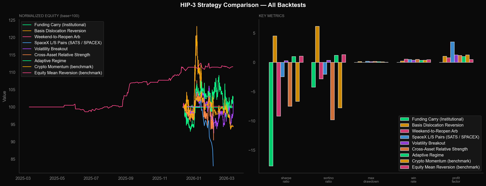
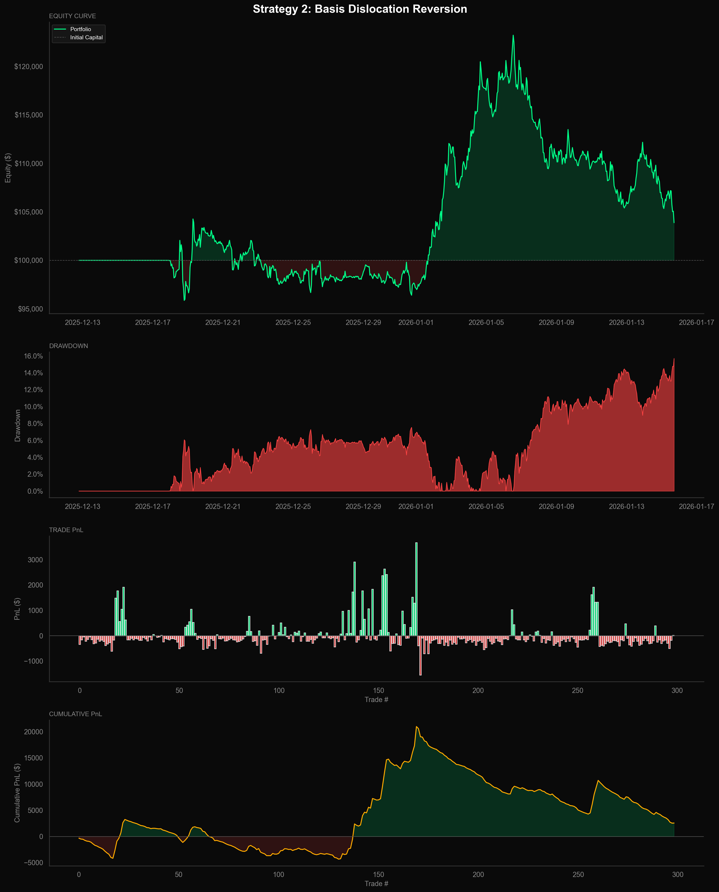

# hype-backtesting

Initial backtesting framework for Hyperliquid perps and HIP-3 strategies.

Early-stage research into funding carry, basis dislocations, and cross-asset momentum on Hyperliquid. Every backtest runs against real market data pulled from the HL API with commissions, slippage, and risk controls built in. Work in progress.

---

## Results

**9 strategies tested** on 90 days of hourly Hyperliquid data (BTC, ETH, SOL, HYPE, TURBO, MEME, WIF) and 1 year of daily US equities (SATS, AAPL, NVDA, GOOGL, SPY).

| Strategy | Return | Sharpe | Sortino | Max DD | Win % | PF | Trades |
|----------|--------|--------|---------|--------|-------|----|--------|
| **Basis Dislocation Reversion** | **+3.88%** | **4.52** | **6.16** | 15.69% | 24.7% | 1.05 | 299 |
| **Adaptive Regime** | **+2.78%** | **0.99** | **1.21** | 11.32% | 34.9% | 1.01 | 211 |
| **Volatility Breakout** | **+1.57%** | **0.29** | **0.36** | 12.77% | 38.0% | 1.28 | 100 |
| Equity Mean Reversion (bench) | +11.60% | 1.07 | 1.33 | 2.18% | 46.7% | 0.50 | 30 |
| Weekend-to-Reopen Arb | +0.17% | -9.20 | -2.81 | 0.93% | 57.1% | 0.80 | 7 |
| Funding Carry | -0.17% | -17.72 | -4.23 | 0.73% | 0.0% | 0.00 | 1 |
| Crypto Momentum (bench) | -5.69% | -6.76 | -7.87 | 10.14% | 38.7% | 1.27 | 93 |
| Cross-Asset Relative Strength | -9.52% | -7.49 | -9.82 | 15.94% | 51.7% | 0.81 | 116 |
| SpaceX L/S Pairs | -16.98% | -2.45 | -2.02 | 18.77% | 50.0% | 3.51 | 6 |

### Strategy Comparison



### Basis Dislocation Reversion (Best Performer)



---

## Strategies

### HIP-3 Specific (4 strategies)

| Strategy | What it does | Why it should work |
|----------|-------------|-------------------|
| **Funding Carry** | Enters when funding rate spikes above normal, sized by volatility | High-carry perps like TURBO pay 994% annualized -- collect that premium |
| **Basis Dislocation Reversion** | Fades large mark-vs-oracle price gaps when they hit the 90th percentile | These gaps are temporary -- on silver, a 463bps gap closed to <50bps in 19 minutes |
| **Weekend-to-Reopen** | Trades the drift between Friday close and Monday open | HL trades 24/7 but thin weekend liquidity causes prices to overshoot |
| **SpaceX L/S Pairs** | Long SATS equity / short high-carry perp, collect funding | Captures the valuation gap between proxy equity and HL perp pricing |

### Cross-Asset (3 strategies)

| Strategy | What it does | Why it should work |
|----------|-------------|-------------------|
| **Volatility Breakout** | Buys breakouts above N-bar highs when volume confirms | Big moves with volume behind them tend to continue, not reverse |
| **Relative Strength L/S** | Ranks all assets by recent return, longs the winners, shorts the losers | Outperformers keep outperforming in the short term (momentum effect) |
| **Adaptive Regime** | Detects if market is trending or ranging, picks the right strategy for each | Trending markets get MA crossover; ranging markets get Bollinger + RSI |

### Benchmarks (5 strategies)

| Strategy | Signal |
|----------|--------|
| Funding Rate Arb | Z-score of 8h funding rate |
| Basis Trade | Mark vs oracle premium |
| Cross-Asset Momentum | Dual MA crossover + volume confirmation |
| Mean Reversion (BB+RSI) | Bollinger Bands + RSI oversold/overbought |
| HIP-3 Yield Rotation | Sharpe-ranked vault allocation |

---

## Microstructure Toolkit

Tools for measuring market quality and comparing venues:

- **Kyle's lambda** -- how much prices move per unit of order flow (price impact)
- **Amihud illiquidity** -- ratio of price movement to volume (how hard it is to trade without moving the price)
- **Roll spread** -- estimates the real bid-ask spread from how returns bounce around
- **Basis decomposition** -- breaks down the total basis into oracle tracking error + perp premium
- **Depth profiling** -- how much money sits within X basis points of the best price
- **Funding carry attribution** -- breaks down P&L into funding collected vs. price movement

Sample output from live Hyperliquid data:

```
BTC   -- Vol: 50.7% | Funding: 1.2% ann. | Premium: -3.22 bps median
ETH   -- Vol: 66.6% | Funding: -2.6% ann. | Premium: -3.78 bps median
SOL   -- Vol: 79.5% | Funding: 0.2% ann. | Premium: -8.43 bps median
TURBO -- Vol: 101.9% | Funding: -5.5% ann. | Premium: -9.64 bps median
```

---

## Architecture

```
hype-backtesting/
├── src/                            # Python: backtesting engine + strategies
│   ├── data/
│   │   ├── hyperliquid.py          # HL API client (candles, funding, HIP-3 vaults, OI)
│   │   └── equities.py            # yfinance wrapper with parquet caching
│   ├── engine/
│   │   ├── backtest.py            # Bar-by-bar backtesting engine
│   │   └── portfolio.py           # Positions, stops, trailing stops, kill switch
│   ├── strategies/                 # 12 strategy implementations
│   ├── research/
│   │   └── microstructure.py      # Kyle lambda, Amihud, Roll, basis decomposition
│   └── analytics/
│       ├── metrics.py             # Sharpe, Sortino, Calmar, drawdown, profit factor
│       └── visualization.py       # Dark-themed equity curves and comparison charts
├── risk-engine/                    # Rust: real-time portfolio risk service
│   └── src/main.rs                # VaR, CVaR, exposure limits, concentration checks
├── services/ingest/                # Go: WebSocket data ingestion
│   └── main.go                    # HL WebSocket feed -> normalize -> Redis
├── dashboard/                      # TypeScript/React: monitoring UI
│   └── src/
│       ├── components/            # Risk panel, equity chart, position table
│       ├── hooks/                 # Data fetching (SWR)
│       └── types/                 # Type definitions
├── sql/                            # TimescaleDB schema + analytics queries
├── notebooks/                      # Jupyter research notebooks
├── research/
│   └── run_hip3_analysis.py       # Main runner: data -> analysis -> backtest -> charts
├── scripts/                        # Shell scripts for pipeline and deployment
├── tests/                          # 23 tests
├── Dockerfile                      # Multi-stage builds for all services
├── docker-compose.yml              # Full stack + Redis + TimescaleDB
├── Makefile                        # Build/test/deploy across all languages
└── config/settings.yaml            # Risk limits, API config
```

---

## Setup

```bash
git clone https://github.com/andreaambrosio/hype-backtesting.git
cd hype-backtesting

# Python backtesting (core)
pip install -e ".[dev]"

# Full stack (Docker)
make docker-up
```

## Run

```bash
# Run everything: pull live data, backtest all strategies, generate charts
python3 research/run_hip3_analysis.py

# Quick backtest
python3 run_backtest.py

# Tests
pytest tests/ -v

# Rust risk engine
make risk-build && make risk-run

# Go ingestion service
make ingest-build && make ingest-run

# Dashboard
cd dashboard && npm install && npm run dev

# Full stack via Docker
make docker-up
```

## Data Sources

- **Hyperliquid API** -- candles, funding rates, premium, HIP-3 vault data (no key needed)
- **yfinance** -- US equities OHLCV + fundamentals (no key needed)

---

## References

- Blockworks Research: *HIP-3 Silver Microstructure: Hyperliquid vs. CME* (2026)
- Hasbrouck, J. (2007). *Empirical Market Microstructure*
- O'Hara, M. (1995). *Market Microstructure Theory*
- Roll, R. (1984). *A Simple Implicit Measure of the Effective Bid-Ask Spread*
- Amihud, Y. (2002). *Illiquidity and Stock Returns*
- Kyle, A.S. (1985). *Continuous Auctions and Insider Trading*
